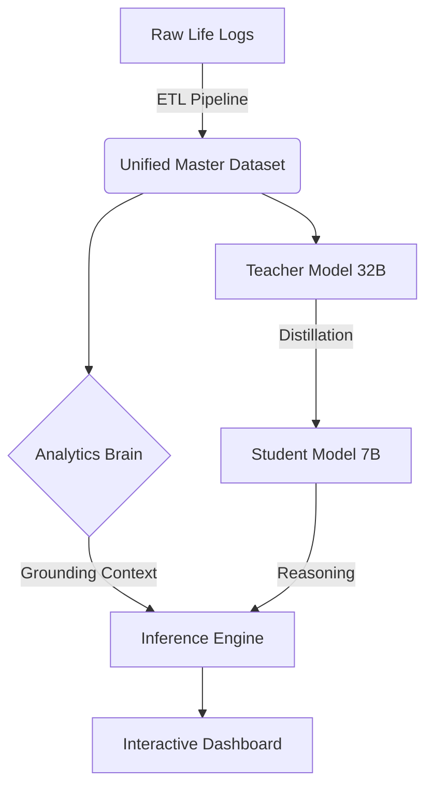

# 🧠 Personal-Emotional-Intelligence-Engine-Real-World-Mood-Modeling-Causal-Analytics-LLM-Reasoning
**A Neuro-Symbolic AI framework that fuses longitudinal life-logging (500+ days) with Knowledge Distillation to create a grounded, scientifically accurate personal psychology assistant.**


## 🏗 System Architecture

This system moves beyond standard "therapy chatbots" by enforcing a **Grounding-First Architecture**. The LLM is not allowed to hallucinate patterns; it is forced to reason over a deterministic statistical "Brain" derived from raw data.



---

## 📂 1. Data Provenance & Feature Engineering

The foundation is a unified time-series dataset () aggregated from 7 distinct APIs and export streams. All streams are synchronized to a daily resolution.

| Data Source | Type | Extraction Method | Key Features Extracted |
| --- | --- | --- | --- |
| **How We Feel** | Behavioral | App Export (CSV) | `mood`, `sleep`, `steps`, `location`, `activities` |
| **Spotify** | Auditory | JSON Export | `music_minutes`, `skip_rate` (restlessness), `top_artist` |
| **Firefox** | Cognitive | History Parsing | `productivity_score`, `distraction_ratio`, `cog_load` |
| **Paytm/UPI** | Financial | Excel Export | `daily_spend`, `impulse_txn_count`, `entertainment_cost` |
| **Google Maps** | Geospatial | Timeline JSON | `city_location`, `travel_status` |
| **OpenAQ** | Environmental | API Fetch | `pm2_5` (Air Quality Index at location) |
| **GNews** | Social | NLP Sentiment | `national_news_sentiment` (Macro-emotional climate) |

**Preprocessing:**

* **Temporal Alignment:** All timestamps normalized to `YYYY-MM-DD`.
* **Target Encoding:** 130+ raw mood labels mapped to the **Circumplex Model of Affect** (4 Quadrants: `High Energy Pleasant`, `Low Energy Pleasant`, etc.).

---

## 🧠 2. The "Analytics Brain" (Statistical Engine)

Before the LLM speaks, the **Analytics Engine** (`analytics_brain.py`) computes the ground truth. This is a deterministic module using Pandas/Scipy.

* **Bayesian Priors:** Baseline probability of specific moods given the day of the week.
* **Granger Causality:** Lags calculated to see if  behavior predicts  mood.
* **Correlation Matrix:** Pearson coefficients for `Sleep` vs `Anxiety`, `Spending` vs `Mood`.
* **Simulation:** A functional engine to calculate  Mood based on user input variables.

```python
# Example: How the Brain stores causal relationships
{
  "causal_factors": {
    "sleep_deficit": {"impact": "High Energy Unpleasant", "magnitude": +0.21},
    "high_steps": {"impact": "High Energy Pleasant", "magnitude": +0.18}
  }
}

```

---

## 🤖 3. Model Training: Teacher-Student Distillation

We utilize **Knowledge Distillation** to create a model that is both psychologically profound (like a 32B model) and efficient (runnable on consumer hardware).

### The Teacher (Qwen 2.5 - 32B Instruct)

* **Role:** Data Annotator.
* **Task:** Analyzed all 1325 raw entries to generate high-quality synthetic reasoning chains (psychotherapy-style analysis).
* **Output:** `teacher_dataset_full.json`

### The Student (Qwen 2.5 - 7B Instruct)

We fine-tuned the 7B model to mimic the Teacher's reasoning style.

* **Training Config:**
* **Library:** `transformers`, `peft`, `accelerate`
* **Precision:** `bf16`
* **Batch Size:** 1 (w/ Gradient Accumulation = 4)
* **Learning Rate:** `2e-5`
* **Epochs:** 3


**Result:** The Student model achieves near-parity with the Teacher in generating structured emotional insights but runs 4x faster.

---

## 🖥 4. Interactive Dashboard

The frontend is built with **Gradio** / **Streamlit** to visualize the "Brain" and converse with the "Student".

**Key Modules:**

1. **Trend Visualization:** Time-series plots of Mood vs. Sleep/Productivity.
2. **Chat Interface:** RAG-style chat where the LLM has access to the user's stats.
3. **Simulator:** Interactive sliders.

> *User: "What happens if I sleep 8 hours and walk 10k steps?"*
> *System: Simulates inputs through the Analytics Brain → Returns predicted mood probability.*

---

## 🛠 Repository Structure

```text
YourProjectName/
│
├── README.md
├── LICENSE
├── .gitignore
│
├── data/
│   ├── raw/
│   │   ├── how_we_feel_export.csv
│   │   ├── spotify_streaming_history.json
│   │   ├── paytm_transactions.xlsx
│   │   ├── google_maps_timeline.json
│   │   ├── browser_history.json
│   │   ├── aqi_api_responses/
│   │   └── news_api_responses/
│   │
│   ├── processed/
│   │   ├── master_dataset_with_location_ordered.csv
│   │   ├── mood_quadrant_dataset.csv
│   │   ├── teacher_dataset_full.json
│   │   ├── teacher_dataset_clean.json
│   │   └── analytics_brain.json   (final phase-2 brain)
│   │
│   └── metadata/
│       ├── column_definitions.md
│       ├── mood_quadrant_mapping.json
│       └── data_collection_notes.md
│
├── notebooks/
│   ├── 01_data_build.ipynb
│   ├── 02_quadrant_classification.ipynb
│   ├── 03_teacher_generation.ipynb
│   ├── 04_clean_teacher_dataset.ipynb
│   ├── 05_student_training.ipynb
│   ├── 06_analytics_brain_build.ipynb
│   └── 07_dashboard_llm_fusion.ipynb
│
├── models/
│   ├── teacher_qwen32b/      (optional pointers or README; model too large)
│   ├── student_qwen7b/
│   └── checkpoints/
│
├── src/
│   ├── __init__.py
│   │
│   ├── data/
│   │   ├── load_data.py
│   │   ├── preprocess.py
│   │   ├── feature_engineering.py
│   │   └── quadrant_classifier.py
│   │
│   ├── teacher/
│   │   ├── teacher_generate.py
│   │   └── teacher_cleaning.py
│   │
│   ├── student/
│   │   ├── train_student.py
│   │   └── evaluate_student.py
│   │
│   ├── analytics/
│   │   ├── baseline_stats.py
│   │   ├── causal_brain.py
│   │   ├── routine_analysis.py
│   │   ├── context_effects.py
│   │   ├── stress_signature.py
│   │   ├── resilience_engine.py
│   │   └── simulation_engine.py
│   │
│   ├── llm/
│   │   ├── fusion_engine.py      (LLM + brain grounding)
│   │   ├── prompting.py
│   │   └── safeguards.py
│   │
│   └── dashboard/
│       ├── app.ipynb OR app.py   (Streamlit / Gradio)
│       └── assets/
│
├── reports/
│   ├── figures/
│   │   ├── mood_distribution.png
│   │   ├── quadrant_plot.png
│   │   ├── causal_effects.png
│   │   ├── resilience_curve.png
│   │   └── simulation_results.png
│   │
│   ├── analytics_summary.md
│   ├── methodology.md
│   └── findings.md
│
└── requirements.txt

```

## 🚀 Getting Started

1. **Clone the repo**
```bash
git clone https://github.com/AkshitSingh7/Personal-Emotional-Intelligence-Engine-Real-World-Mood-Modeling-Causal-Analytics-LLM-Reasoning.git

```


2. **Install dependencies**
```bash
pip install -r requirements.txt

```


3. **Run the Dashboard**
```bash
streamlit run app/dashboard.py

```


---

## 📜 License

MIT License. Data samples provided are anonymized.
