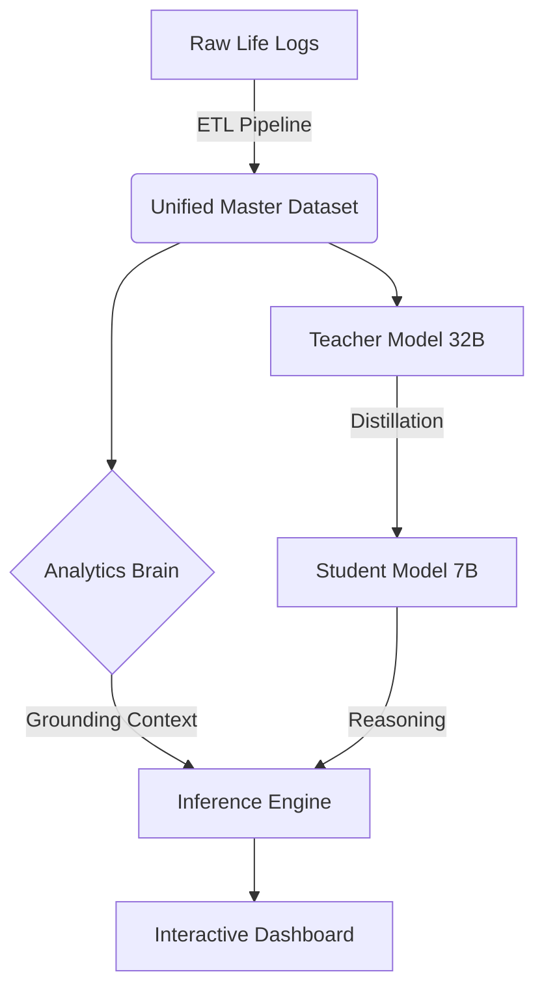

# 🧠 Personal-Emotional-Intelligence-Engine-Real-World-Mood-Modeling-Causal-Analytics-LLM-Reasoning
**A Neuro-Symbolic AI framework that fuses longitudinal life-logging (500+ days) with Knowledge Distillation to create a grounded, scientifically accurate personal psychology assistant.**


## 🏗 System Architecture

This system moves beyond standard "therapy chatbots" by enforcing a **Grounding-First Architecture**. The LLM is not allowed to hallucinate patterns; it is forced to reason over a deterministic statistical "Brain" derived from raw data.



---

## 📂 1. Data Provenance & Feature Engineering

The foundation is a unified time-series dataset aggregated from distinct APIs and export streams. All streams are synchronized to a daily resolution.

### 📊 Full Data Schema 

| Data Source | Type | Extraction Method | Columns (Features) | Count |
| --- | --- | --- | --- | --- |
| **Time & Metadata** | Indexing | Derived | `timestamp`, `date_only`, `hour`, `day_name` | **4** |
| **How We Feel** | Behavioral | App Export (CSV) | `mood_label`, `sleep_hours`, `step_count`, `people`, `location_label`, `activity`, `weather_desc`, `temp_c` | **8** |
| **Spotify** | Auditory | JSON Export | `music_minutes`, `music_songs_count`, `music_skip_count`, `music_skip_rate`, `top_artist` | **5** |
| **Firefox** | Cognitive | History Parsing | `total_visits`, `productive_visits`, `distraction_visits`, `productivity_score`, `distraction_ratio` | **5** |
| **Paytm/UPI** | Financial | Excel Export | `total_spend`, `food_spend`, `entertainment_spend`, `txn_count` | **4** |
| **Google Maps** | Geospatial | Timeline JSON | `location_city` | **1** |
| **OpenAQ** | Environmental | API Fetch | `pm2_5` | **1** |
| **GNews** | Social | NLP Sentiment | `india_news_sentiment` | **1** |
| **Internal Engine** | Psychological | Vector Mapping | `mood_quadrant` | **1** |
| **TOTAL** |  |  |  | **30** |

---

**Preprocessing:**

* **Temporal Alignment:** All timestamps normalized to `YYYY-MM-DD`.
* **Target Encoding:** 130+ raw mood labels mapped to the **Circumplex Model of Affect** (4 Quadrants: `High Energy Pleasant`, `Low Energy Pleasant`, etc.).

---

## 🧠 2. The "Analytics Brain" (Statistical Engine)

Before the LLM speaks, the **Analytics Engine** (`analytics_brain.py`) computes the ground truth. This is a deterministic module using Pandas/Scipy.

* **Bayesian Priors:** Baseline probability of specific moods given the day of the week.
* **Granger Causality:** Lags calculated to see if  behavior predicts  mood.
* **Correlation Matrix:** Pearson coefficients for `Sleep` vs `Anxiety`, `Spending` vs `Mood`.
* **Simulation:** A functional engine to calculate  Mood based on user input variables.

```python
# Example: How the Brain stores causal relationships
{
  "causal_factors": {
    "sleep_deficit": {"impact": "High Energy Unpleasant", "magnitude": +0.21},
    "high_steps": {"impact": "High Energy Pleasant", "magnitude": +0.18}
  }
}

```

---

## 🤖 3. Model Training: Teacher-Student Distillation

We utilize **Knowledge Distillation** to create a model that is both psychologically profound (like a 32B model) and efficient (runnable on consumer hardware).

### The Teacher (Qwen 2.5 - 32B Instruct)

* **Role:** Data Annotator.
* **Task:** Analyzed all 1325 raw entries to generate high-quality synthetic reasoning chains (psychotherapy-style analysis).
* **Output:** `teacher_dataset_full.json`

### The Student (Qwen 2.5 - 7B Instruct)

We fine-tuned the 7B model to mimic the Teacher's reasoning style.

* **Training Config:**
* **Library:** `transformers`, `peft`, `accelerate`
* **Precision:** `bf16`
* **Batch Size:** 1 (w/ Gradient Accumulation = 4)
* **Learning Rate:** `2e-5`
* **Epochs:** 3


**Result:** The Student model achieves near-parity with the Teacher in generating structured emotional insights but runs 4x faster.

---

## 🖥 4. Interactive Dashboard

The frontend is built with **Gradio** / **Streamlit** to visualize the "Brain" and converse with the "Student".

**Key Modules:**

1. **Trend Visualization:** Time-series plots of Mood vs. Sleep/Productivity.
2. **Chat Interface:** RAG-style chat where the LLM has access to the user's stats.
3. **Simulator:** Interactive sliders.

> *User: "What happens if I sleep 8 hours and walk 10k steps?"*
> *System: Simulates inputs through the Analytics Brain → Returns predicted mood probability.*

---

## 🛠 Repository Structure

```text
Personal-Emotional-Intelligence-Engine/
│
├── app/                      
│   └── dashboard.py           
│
├── data/                     
│   ├── mock_samples/          
│   │   └── master_dataset_mock.csv
│   ├── raw/                  
│   └── processed/            
│
├── notebooks/               
│   ├── 01_Data_Processing.ipynb          
│   ├── 02_Exploratory_Analysis.ipynb    
│   └── 03_Teacher_Student_Training.ipynb
│
├── src/                       
│   ├── __init__.py            
│   ├── analytics.py           
│   ├── config.py             
│   ├── etl.py                
│   ├── generate_mock_data.py  
│   └── llm_engine.py          
│
├── .gitignore                
├── README.md                 
└── requirements.txt           
```

## 🚀 Getting Started

1. **Clone the repo**
```bash
git clone https://github.com/AkshitSingh7/Personal-Emotional-Intelligence-Engine-Real-World-Mood-Modeling-Causal-Analytics-LLM-Reasoning.git

```


2. **Install dependencies**
```bash
pip install -r requirements.txt

```


3. **Run the Dashboard**
```bash
streamlit run app/dashboard.py

```


---

## 📜 License

MIT License. Data samples provided are anonymized.
